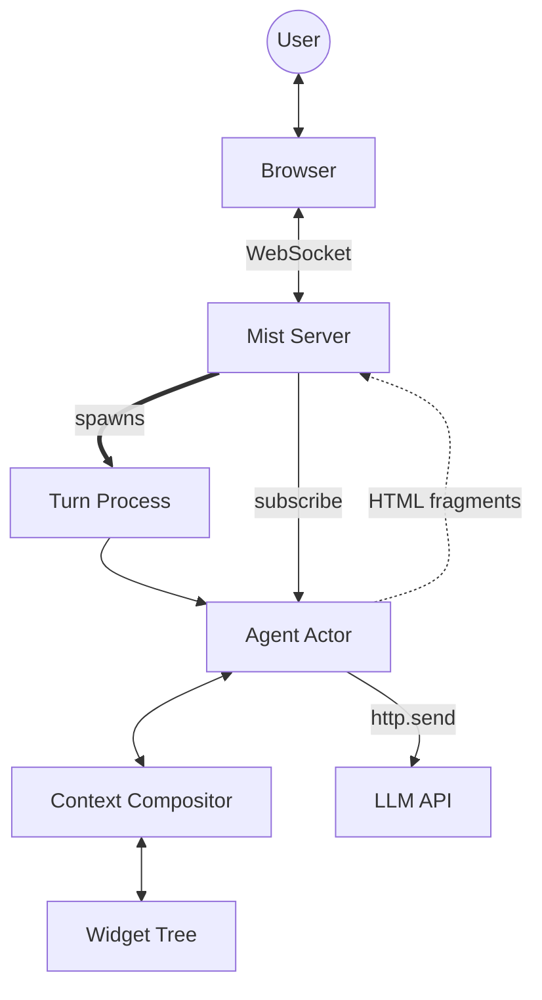

# Architecture Overview

Eddie is a Gleam reimplementation of Calipso — an Elm-architecture widget system that builds shared context between a user and an AI agent. Each widget has a model, typed messages, a pure update function, and three views: LLM messages, LLM tools, and browser HTML.

## How it works

The **agent loop** is the core cycle:

1. User sends a message through the browser over WebSocket
2. The mist server spawns a helper process that calls `agent.run_turn` (blocking)
3. The agent adds the user message to the Context, then enters the turn loop
4. Each iteration: compose messages + tools → build HTTP request → send to LLM → parse response
5. If the response contains tool calls, dispatch each to its owning widget via the Context compositor
6. Record tool results in the conversation log, then loop back to step 4
7. When the LLM responds with text only, the turn completes and the result is sent back over WebSocket
8. After every state mutation, the agent computes `changed_html` and pushes HTML fragments to all subscribed WebSocket connections

## Key differences from Calipso

| Aspect | Calipso (Python) | Eddie (Gleam) |
|---|---|---|
| Agent model | Mono-agent asyncio | OTP actor (single-threaded, message-based) |
| Frontend | htmx SPA (no build step) | Inline HTML + plain JS over WebSocket (no build step) |
| Widget HTML | Plain HTML strings with htmx OOB swaps | Lustre element types, serialised with `data-swap-oob` for manual DOM swap |
| LLM client | Pydantic AI | glopenai (sans-IO) + gleam_httpc |
| Structured output | Pydantic AI built-in | Custom layer using sextant (Phase 5) |
| State mutation | Mutable models (in-place) | Immutable models (update returns new value) |
| Type erasure | Python `Any` + duck typing | Opaque type with closures over typed internals |
| Update push | `on_update` callback | Subscriber `Subject(String)` pattern |

## Widget tree

The agent's context is composed from a tree of widgets, orchestrated by the **Context compositor**:

- **SystemPrompt** — provides the agent's identity and framing text as a system message
- **ConversationLog** — manages task-partitioned conversation history, memory management, and the task protocol that governs when non-task tools can be called

Additional widgets (goal, token usage, file explorer) are planned for Phase 6.

## Context compositor and LLM bridge

The **Context** (`eddie/context`) is the root compositor that holds the widget tree, routes tool calls to their owning widgets, and enforces the task protocol before dispatch. It composes messages and tools from all widgets in a fixed order (system prompt → children → conversation log).

The **LLM bridge** (`eddie/llm`) converts between Eddie types and glopenai types in a sans-IO style — it builds HTTP requests and parses responses without performing network IO. The **HTTP layer** (`eddie/http`) is the only module that touches the network.

## Module map

See [Components](./components.md) for the full breakdown.
