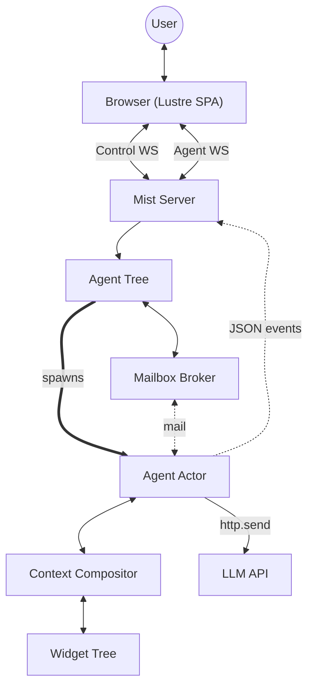

# Architecture Overview

Eddie is a Gleam reimplementation of Calipso — an Elm-architecture widget system that builds shared context between a user and an AI agent. Each widget has a model, typed messages, a pure update function, and three views: LLM messages, LLM tools, and domain state events (for the frontend).

## How it works

The **agent loop** is the core cycle:

1. User sends a `ClientCommand` (JSON) through the Lustre SPA over WebSocket
2. The server parses the command and calls `agent.send_message` (fire-and-forget)
3. The agent adds the user message to the Context, spawns an async LLM call process
4. When the LLM responds: parse response, dispatch tool calls (some may spawn async effect processes)
5. When all effects complete: record tool results, spawn the next LLM call
6. When the LLM responds with text only, the turn completes
7. After every state mutation, the agent computes `changed_state` and pushes JSON-encoded `ServerEvent` lists to all subscribed WebSocket connections
8. The Lustre SPA decodes `ServerEvent` arrays and updates its model, rendering the chat UI and sidebar panels

The **two WebSocket channels** serve different purposes:

- `/ws/control` — always connected, receives `AgentTreeChanged` events, sends `SpawnRootAgent` commands
- `/ws/<agent_id>` — connected only when viewing a specific agent's conversation, carries per-agent state events and commands

## Key differences from Calipso

| Aspect | Calipso (Python) | Eddie (Gleam) |
|---|---|---|
| Agent model | Mono-agent asyncio | OTP actor (single-threaded, message-based) |
| Frontend | htmx SPA (no build step) | Lustre SPA (JS target, `lustre_websocket`) |
| Widget output | Plain HTML strings with htmx OOB swaps | `List(ServerEvent)` domain events, JSON-encoded over WebSocket |
| LLM client | Pydantic AI | glopenai (sans-IO) + gleam_httpc |
| Structured output | Pydantic AI built-in | Custom layer using sextant (Phase 5) |
| State mutation | Mutable models (in-place) | Immutable models (update returns new value) |
| Type erasure | Python `Any` + duck typing | Opaque type with closures over typed internals |
| Update push | `on_update` callback | Subscriber `Subject(String)` pattern (JSON-encoded `ServerEvent` lists) |

## Widget tree

The agent's context is composed from a tree of widgets, orchestrated by the **Context compositor**:

- **SystemPrompt** — provides the agent's identity and framing text as a system message
- **Goal** — tracks the conversation objective (protocol-free, callable without active task)
- **FileExplorer** — filesystem navigation using `CmdEffect` for IO operations
- **TokenUsage** — display-only widget tracking input/output tokens per LLM request
- **ConversationLog** — manages task-partitioned conversation history, memory management, and the task protocol that governs when non-task tools can be called
- **SubagentManager** — gives agents the `spawn_subagent` and `list_subagents` tools (injected by `AgentTree` at spawn time)
- **Mailbox** — parent-child communication via free-form messages through a central broker (injected by `AgentTree` at spawn time)

## Rose-tree agent forest

Eddie supports a **list of rose-trees** of agents — arbitrary-depth nesting with multiple independent root agents. No agent exists at startup; the user creates root agents from the landing page via a "+" button.

`AgentTree` is an OTP actor that manages a flat `Dict(String, AgentEntry)` of all agents, with parent-child relationships tracked via `parent_id` and `child_ids` fields. A `build_tree` function assembles the rose-tree forest on demand for the frontend.

Root agents are created by the user through the control WebSocket (`SpawnRootAgent`). Child agents are spawned by parent agents using the `spawn_subagent` tool, which generates a UUID, creates the child with a goal and initial message, and starts the child's turn loop immediately. Children run in the background and communicate with their parent via the mailbox widget.

The `AgentTree` injects `SubagentManager` and `Mailbox` widget handles into each agent's `extra_widgets` at spawn time, using closures to avoid import cycles between `agent_tree` and the widget modules.

The **Mailbox Broker** is a separate OTP actor that routes free-form text messages between agents. Each agent's mailbox widget communicates with the broker via `CmdEffect`. The broker stores inboxes and outboxes, tracks read/unread state, and notifies subscribers when new mail arrives.

## Context compositor and LLM bridge

The **Context** (`eddie/context`) is the root compositor that holds the widget tree, routes tool calls to their owning widgets, and enforces the task protocol before dispatch. It composes messages and tools from all widgets in a fixed order (system prompt → children → conversation log).

The **LLM bridge** (`eddie/llm`) converts between Eddie types and glopenai types in a sans-IO style — it builds HTTP requests and parses responses (including token usage data) without performing network IO. The **HTTP layer** (`eddie/http`) is the only module that touches the network.

## Structured output

The **structured output layer** (`eddie/structured_output`) extracts typed Gleam values from LLM responses. It wraps a sextant schema in an `OutputSchema(a)` and offers two strategies: **tool-call** (register a fake tool, validate its arguments) and **native** (send `response_format` with json_schema, validate the text response). Both share a retry loop that feeds validation errors back to the LLM as structured feedback. The module follows the same sans-IO pattern as the LLM bridge — the caller injects a `send_fn`.

## Module map

See [Components](./components.md) for the full breakdown.
