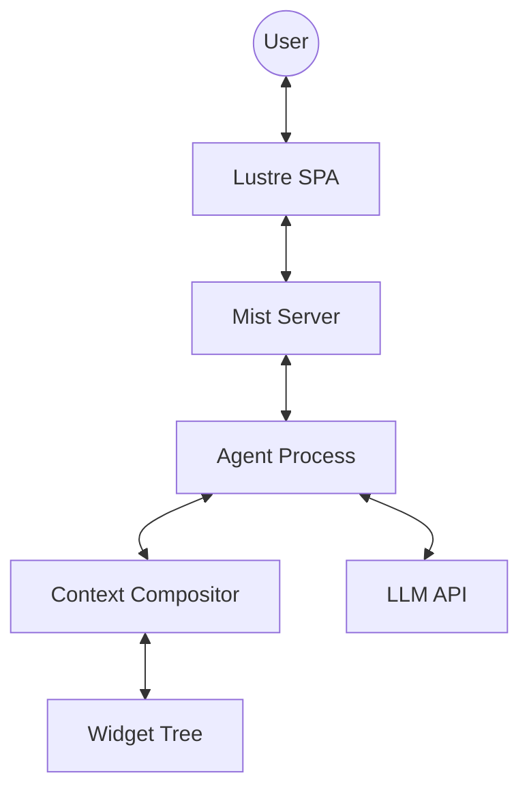

# Architecture Overview

Eddie is a Gleam reimplementation of Calipso — an Elm-architecture widget system that builds shared context between a user and an AI agent. Each widget has a model, typed messages, a pure update function, and three views: LLM messages, LLM tools, and browser HTML.

## How it works

The **agent loop** is the core cycle:

1. User sends a message through the browser
2. The agent composes a prompt from all widgets' `view_messages` and `view_tools`
3. The LLM responds with text or tool calls
4. Tool calls are dispatched to the owning widget via the Context compositor
5. The widget's `update` function produces a new model and a `Cmd`
6. The loop repeats until the LLM produces a text-only response

## Key differences from Calipso

| Aspect | Calipso (Python) | Eddie (Gleam) |
|---|---|---|
| Agent model | Mono-agent server | OTP multi-agent with hierarchical spawning |
| Frontend | htmx SPA (no build step) | Lustre SPA (compiled Gleam to JS) |
| Widget HTML | Plain HTML strings | Lustre element types (type-safe) |
| LLM client | Pydantic AI | glopenai (sans-IO) + gleam_httpc |
| Structured output | Pydantic AI built-in | Custom layer using sextant (JSON Schema) |
| State mutation | Mutable models (in-place) | Immutable models (update returns new value) |
| Type erasure | Python `Any` + duck typing | Opaque type with closures over typed internals |

## Module map

See [Components](./components.md) for the full breakdown.
